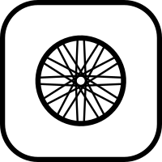
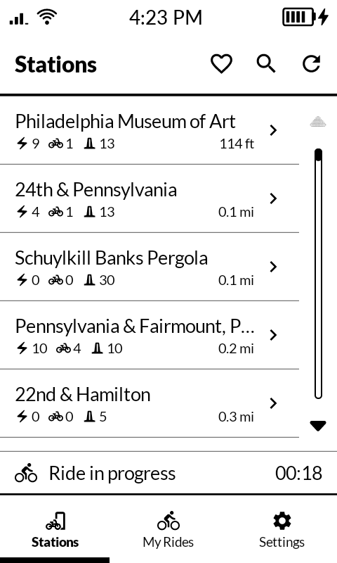
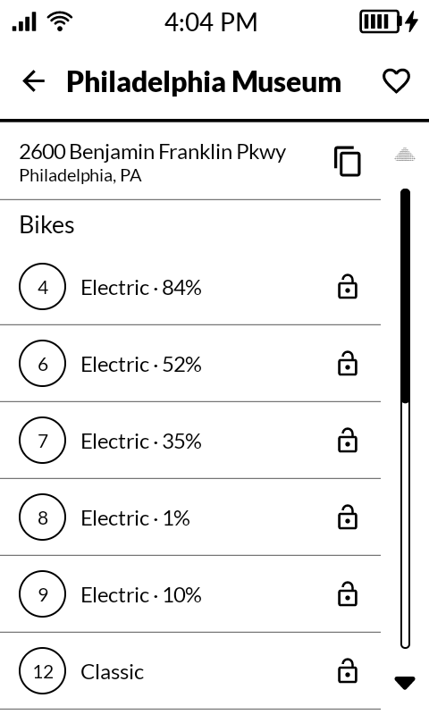
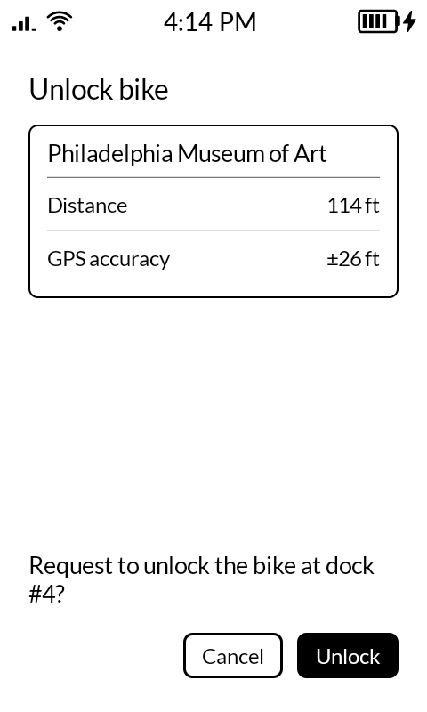
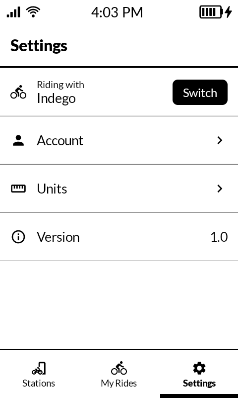
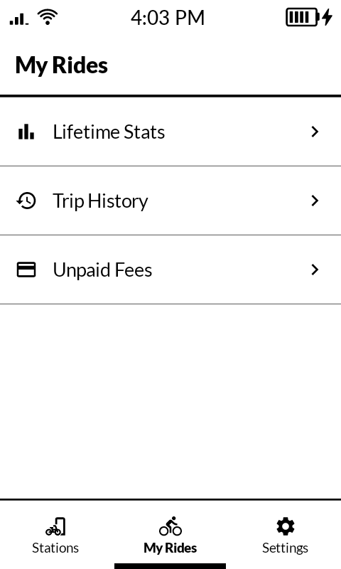
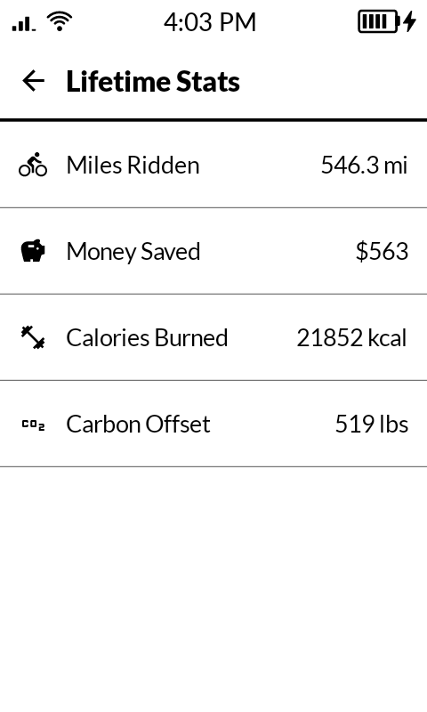
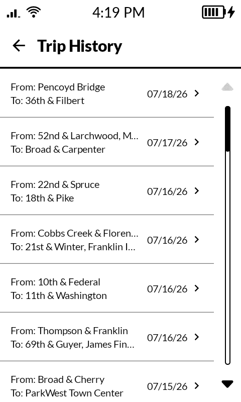
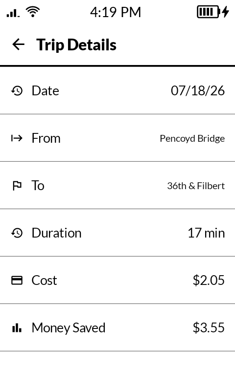

<br clear="all" />

# Spoke

**Spoke** is a lightweight e-ink friendly Android client for BCycle bike share systems in Philadelphia, Los Angeles, and Las Vegas. Designed for the **Mudita Kompakt** according to [Mudita Mindful Design](https://mudita.com/community/blog/introducing-mudita-mindful-design/) guidelines, this app provides a de-Googled and distraction free interface for finding local bike share stations, checking out bikes, and viewing your trip history. 

## Screenshots

| Stations | Station Details | Bike Checkout | Settings |
|----------|-----------------|--------|----------|
|  |  |  |  |

| My Rides | Lifetime Stats | Trip History | Trip Details |
|----------|-----------------|--------|-----------------------------------------------------|
|  |  |  |  |


## Features

- **Real-time bike share station status** - bike availability, battery percentage, distance from user location
- **Find bike stations near you** - using location sharing
- **Get station statuses** - bike availability, number of open docks, battery percentage for electric bikes
- **Checkout bikes** - unlock bikes in-app and track your ride status
- **Trip tracking** - see your all-time trip history and specific trip details
- **Lifetime account stats** - surface stats hidden in the BCycle API like money saved and carbon offset
- **E-ink Friendly Design** - app UI designed for e-ink screens based on Mudita Mindful Design guidelines

## Supported Rideshare Systems

As of v1.0, Spoke supports the following BCycle bike share systems:

- **Indego** (Philadelphia, PA) (full support)
- **Metro Bike Share** (Los Angeles, CA) (partial support)
- **RTC Bike Share** (Las Vegas, NV) (read only support) 

For a full feature matrix of supported features across these systems, see [CHANGELOG.MD](./CHANGELOG.md#feature-support-by-system).

You can also request support for another bike share system [here]().

## Requirements

- Android API Level 31+ (Android 12+)
- Android Studio Narwhal (2025.1) or newer (required for Android Gradle Plugin 9.x)
- Kotlin 2.2.10+
- JDK 17+
- Gradle 9.6.1 (provided via the Gradle wrapper)

## Installation

### Development Setup

1. Clone the repository:
   ```bash
   git clone https://github.com/Snarr/Spoke.git
   cd Spoke
   ```

2. Configure `local.properties` in the project root (create it if it doesn't exist):
   ```properties
   sdk.dir=/path/to/your/Android/SDK
   ```
   This file tells Gradle where your Android SDK is installed. Android Studio typically creates this automatically, but if you're building from the command line, you may need to create it manually.

3. Configure the required secrets in your global Gradle properties file at `~/.gradle/gradle.properties` (create it if it doesn't exist):
   ```properties
   INDEGO_SECRET=your_indego_api_secret
   METRO_BIKE_SHARE_SECRET=your_metro_api_secret
   ```

> [!TIP]
> You can find these secrets by intercepting API requests made from a system's respective bike share app. In an abundance of caution, I won't be publishing these secrets to GitHub even though they're unobscured and easy to find.

4. Open the project in Android Studio:
   ```bash
   open -a "Android Studio" .
   ```

5. Build and run the app on an emulator or connected device:
   - Click "Run" or press `Ctrl+R` (Linux/Windows) / `Cmd+R` (macOS)

### Building a Release

To build a signed release APK:

```bash
./gradlew clean bundleRelease
```

The signed app bundle will be available at:
```
app/build/outputs/bundle/release/app-release.aab
```

## Project Structure

```
Spoke/
├── app/                      # Main application module
│   ├── src/main/java/        # Kotlin source code
│   ├── src/main/res/         # Android resources
│   ├── src/main/AndroidManifest.xml
│   ├── src/test/             # Unit tests
│   ├── src/androidTest/      # Instrumentation tests
│   └── build.gradle.kts      # App build configuration
├── config/detekt/            # Detekt static-analysis config
├── gradle/                   # Gradle wrapper & version catalog
├── .github/                  # Issue templates & CI workflows
├── build.gradle.kts          # Root build configuration
├── settings.gradle.kts       # Gradle settings
└── CONTRIBUTING.md           # Contribution guidelines
```

## Testing

Run the test suite:

```bash
./gradlew test
```

## Code Quality

This project uses several tools to maintain code quality:

- **Detekt**: Kotlin static analysis
- **Spotless**: Code formatting

Run code quality checks:

```bash
./gradlew detekt
./gradlew spotlessCheck
```

To automatically format code:

```bash
./gradlew spotlessApply
```

## Contributing

Contributions are welcome! Please see [CONTRIBUTING.md](CONTRIBUTING.md) for guidelines on how to contribute to Spoke.

## License

This project is licensed under the MIT License - see the [LICENSE](LICENSE) file for details.

## Acknowledgments

- Designed for [Mudita Kompakt](https://mudita.com/)
- Powered by [BCycle](https://www.bcycle.com/) bike-share systems:
  - [Indego](https://www.rideindego.com/) (Philadelphia)
  - [Metro Bike Share](https://www.metrobikeshare.com/) (Los Angeles)
  - [RTC Bike Share](https://www.rtcbikeshare.com/) (Las Vegas)

## Support

For issues, feature requests, or general questions:
- Open an [issue](https://github.com/Snarr/Spoke/issues)
- Check existing [discussions](https://github.com/Snarr/Spoke/discussions)
